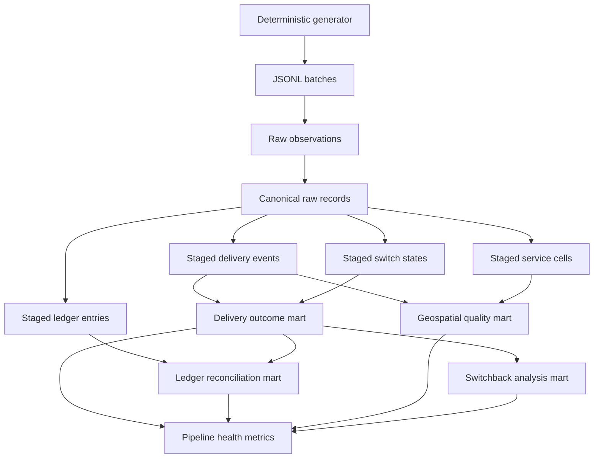

# Architecture

## Design goals

The platform is small enough to run in seconds while preserving the failure
modes that matter in event-driven analytics: duplicated observations, revised
events, late records, replayed batches, conflicting event time and record time,
financial reversals, invalid coordinates, and time-varying treatment state.

## Layer responsibilities

### Generated source

The generator fixes its seed and clock. It writes stable JSON with sorted keys,
so two runs with the same arguments produce byte-identical batches.

### Raw observations

Each source line receives an observation hash based on an immutable batch
identity (file name plus content digest), line number, and record hash. This
retains evidence that a duplicate was observed while keeping replays
idempotent.

### Canonical raw records

The canonical table is keyed by a SHA-256 digest of the normalized record.
The same record in another file is stored once. A genuine revision has a new
version or payload and remains available for downstream resolution.

### Staging

Each business key resolves with this deterministic order:

1. greatest version;
2. latest record time;
3. greatest record hash as the final tie-break.

No ingestion order is used as business truth.

### Marts

Delivery outcomes select the first request, the latest accepted dispatch event,
and the latest terminal event. Treatment state is reconstructed from the most
recent state effective at request time. Separate marts handle ledger invariants,
planar geospatial checks, switchback rates, and pipeline-health metrics.

## Rebuild strategy

Raw tables persist across runs. Derived tables are replaced inside one SQLite
transaction. Replaying the same files leaves raw cardinality and every mart
unchanged. Loading a later batch changes only the canonical state implied by
the new records.
